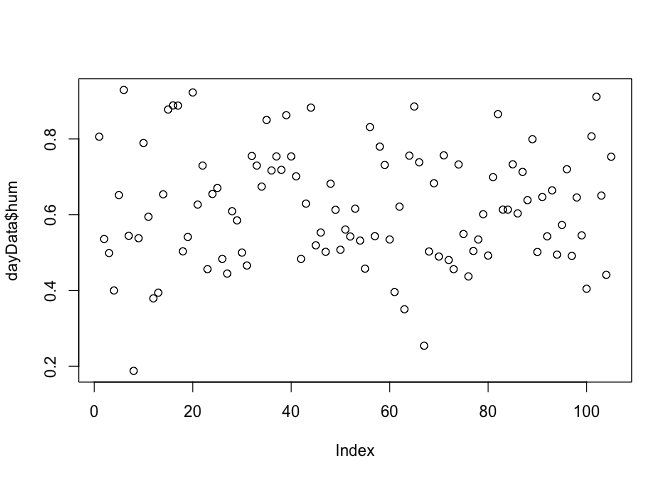
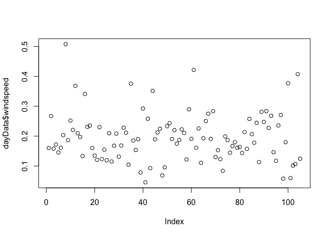
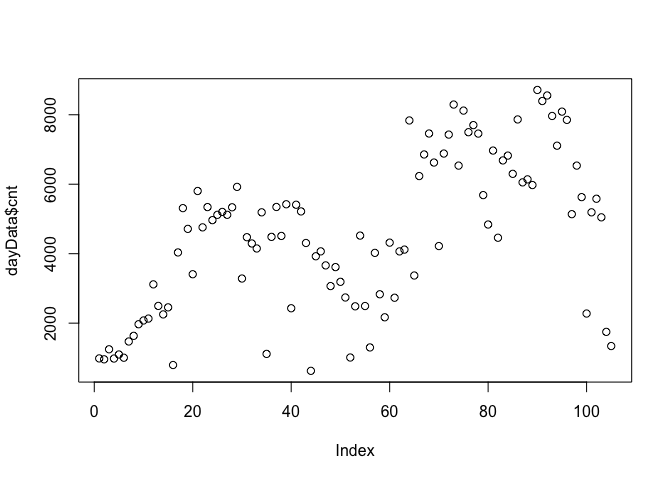
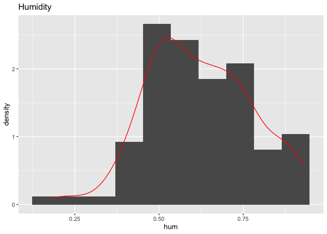
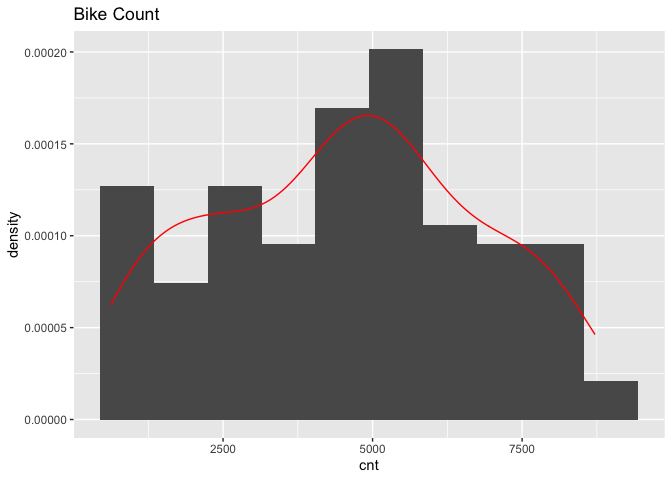
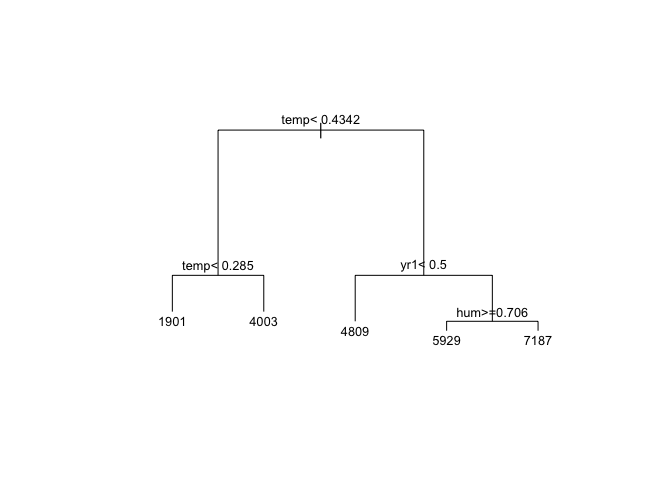

ST558 Project 2: Bike Sharing Analysis
================
Lynn Huang
September 18, 2020

  - [Prepare Data](#prepare-data)
  - [Explore Data](#explore-data)
  - [Regression Tree with LOOCV](#regression-tree-with-loocv)
  - [Boosted Tree with CV](#boosted-tree-with-cv)
  - [Final Model](#final-model)
  - [R Markdown Automation Code](#r-markdown-automation-code)

#### Prepare Data

Source: [UCI Machine Learning
Repository](https://archive.ics.uci.edu/ml/datasets/Bike+Sharing+Dataset)  
We will predict the amount of total rental bikes using predictors like
time of year or time of the week.  
There are n=731 observations and p=16 variables on the Capital bike
sharing system (Washington DC) in 2011-2012:

1.  (ignored\!) instant = Record index (like an observation number)  
2.  (ignored\!) dteday = Date (MM/DD/YYYY format)  
3.  season = Categorical numeric var (1:winter, 2:spring, 3:summer,
    4:fall)  
4.  yr = Year (0:2011, 1:2012)  
5.  mnth = Month (1 to 12)  
6.  holiday = Whether the day is a holiday or not (1/0)  
7.  weekday = Day of the week (0:Sunday to 6:Saturday)  
8.  workingday = Whether the day is a working day or weekend/holiday
    (1/0)  
9.  weathersit = Categorical numeric var for weather situation (1:mild
    to 4:severe)
      - Clear, Few clouds, Partly cloudy  
      - Mist + Cloudy, Mist + Broken clouds, Mist + Few clouds, Mist  
      - Light snow, Light rain + Thunderstorm + Scattered clouds, Light
        rain + Scattered clouds  
      - Heavy rain + Ice pallets + Thunderstorm + Mist, Snow + Fog  
10. temp = Normalized hourly temp in Celsius (Temp - Min.Temp)/(Max.Temp
    - Min.Temp) for Min.Temp=-8 & Max.Temp=39  
11. atemp = Normalized hourly feeling temp in Celsius for Min.Temp=-16 &
    Max.Temp=50  
12. hum = Normalized humidity (Humidity)/(Max.Humidity) for
    Max.Humidity=100  
13. windspeed = Normalized wind speed (Speed)/(Max.Speed) for
    Max.Speed=67  
14. (ignored\!) casual = Count of casual users  
15. (ignored\!) registered = Count of registered users  
16. cnt = Count of total rental bikes (casual + registered)

We will ignore the `casual` and `registered` variables in our analysis.
We will also split the data into analyses by weekday, so 7 separate
analyses for each weekday from Sunday (weekday=0) to Saturday
(weekday=6). This code is specifically run with \`r Per each weekday, we
will:  
\* Do some preliminary numerical and graphical summaries  
\* Split data into 70% training, 30% test data sets  
\* Create a tree-based model using leave one out cross-validation  
\* Create a boosted tree model using cross-validation  
\* Comparison of model performances on the test data set, and selection
of a ‘best model’

``` r
# Drop unused data and make factors as needed for categorical vars
bikeData <- read_csv("day.csv", col_names=TRUE) %>% select(-instant, -dteday, -casual, -registered)
```

    ## Parsed with column specification:
    ## cols(
    ##   instant = col_double(),
    ##   dteday = col_date(format = ""),
    ##   season = col_double(),
    ##   yr = col_double(),
    ##   mnth = col_double(),
    ##   holiday = col_double(),
    ##   weekday = col_double(),
    ##   workingday = col_double(),
    ##   weathersit = col_double(),
    ##   temp = col_double(),
    ##   atemp = col_double(),
    ##   hum = col_double(),
    ##   windspeed = col_double(),
    ##   casual = col_double(),
    ##   registered = col_double(),
    ##   cnt = col_double()
    ## )

``` r
bikeData$season <- as.factor(bikeData$season)
bikeData$yr <- as.factor(bikeData$yr)
bikeData$mnth <- as.factor(bikeData$mnth)
bikeData$holiday <- as.factor(bikeData$holiday)
bikeData$weekday <- as.factor(bikeData$weekday)
bikeData$workingday <- as.factor(bikeData$workingday)
bikeData$weathersit <- as.factor(bikeData$weathersit)

# Slice off data for only this weekday (default Sunday)
dayData <- bikeData %>% filter(weekday == params$day)
head(dayData)
```

    ## # A tibble: 6 x 12
    ##   season yr    mnth  holiday weekday workingday weathersit   temp  atemp   hum windspeed   cnt
    ##   <fct>  <fct> <fct> <fct>   <fct>   <fct>      <fct>       <dbl>  <dbl> <dbl>     <dbl> <dbl>
    ## 1 1      0     1     0       6       0          2          0.344  0.364  0.806     0.160   985
    ## 2 1      0     1     0       6       0          2          0.165  0.162  0.536     0.267   959
    ## 3 1      0     1     0       6       0          2          0.233  0.248  0.499     0.158  1248
    ## 4 1      0     1     0       6       0          1          0.0591 0.0791 0.4       0.172   981
    ## 5 1      0     1     0       6       0          1          0.197  0.212  0.652     0.145  1098
    ## 6 1      0     2     0       6       0          2          0.233  0.243  0.929     0.161  1005

``` r
n = nrow(dayData)

# Split into 70% training, 30% test data sets
set.seed(123)
train <- sample(1:n, size = n*0.7)
dayData.train <- dayData[train, ]
dayData.test <- dayData[-train, ]
```

#### Explore Data

We see an even spread across the season, yr, mnth variables (as expected
across a whole year).  
Most of the days were not a holiday. The weekday corresponds to the
report-specific day (as it should\!).

``` r
# Do some basic five-number summaries to check for outliers
summary(dayData)
```

    ##  season yr          mnth    holiday weekday workingday weathersit      temp             atemp        
    ##  1:27   0:53   12     :10   0:105   0:  0   0:105      1:67       Min.   :0.05913   Min.   :0.07907  
    ##  2:26   1:52   1      : 9   1:  0   1:  0   1:  0      2:34       1st Qu.:0.32500   1st Qu.:0.32448  
    ##  3:27          3      : 9           2:  0              3: 4       Median :0.47250   Median :0.46653  
    ##  4:25          4      : 9           3:  0                         Mean   :0.48204   Mean   :0.46207  
    ##                6      : 9           4:  0                         3rd Qu.:0.65917   3rd Qu.:0.61112  
    ##                7      : 9           5:  0                         Max.   :0.86167   Max.   :0.80491  
    ##                (Other):50           6:105                                                            
    ##       hum           windspeed           cnt      
    ##  Min.   :0.1879   Min.   :0.0454   Min.   : 627  
    ##  1st Qu.:0.5029   1st Qu.:0.1443   1st Qu.:2732  
    ##  Median :0.6133   Median :0.1891   Median :4521  
    ##  Mean   :0.6196   Mean   :0.1966   Mean   :4551  
    ##  3rd Qu.:0.7312   3rd Qu.:0.2332   3rd Qu.:6140  
    ##  Max.   :0.9292   Max.   :0.5075   Max.   :8714  
    ## 

``` r
bikeData[is.na(bikeData)==TRUE]
```

    ## <unspecified> [0]

``` r
# Take a look at the numeric, non-factor variables
# Looks like temp, atemp, cnt are clearly bimodal with 2 peaks around indices 20 (May) and 80 (July) when the weather is nice for bike riding!
plot(dayData$temp)
```

<!-- -->

``` r
plot(dayData$atemp)
```

<!-- -->

``` r
plot(dayData$hum)
```

<!-- -->

``` r
plot(dayData$windspeed)
```

<!-- -->

``` r
plot(dayData$cnt)
```

<!-- -->

``` r
# Do some histograms to check the distributions of numeric, non-factor variables
# Temperature, humidity variables are bimodal as expected
ggplot(data=dayData, aes(x=temp)) + geom_histogram(bins=10, aes(y=..density..)) + 
  geom_density(color="red") + labs(title="Actual Temperature")
```

<!-- -->

``` r
ggplot(data=dayData, aes(x=atemp)) + geom_histogram(bins=10, aes(y=..density..)) + 
  geom_density(color="red") + labs(title="Actual Temperature")
```

<!-- -->

``` r
ggplot(data=dayData, aes(x=hum)) + geom_histogram(bins=10, aes(y=..density..)) + 
  geom_density(color="red") + labs(title="Humidity")
```

<!-- -->

``` r
# Windspeed is a bit skewed right, but we're not doing linear regression. This is ok!
ggplot(data=dayData, aes(x=windspeed)) + geom_histogram(bins=10, aes(y=..density..)) + 
  geom_density(color="red") + labs(title="Windspeed")
```

<!-- -->

``` r
# Bike Count shows a huge spread
ggplot(data=dayData, aes(x=cnt)) + geom_histogram(bins=10, aes(y=..density..)) + 
  geom_density(color="red") + labs(title="Bike Count")
```

<!-- -->

#### Regression Tree with LOOCV

We will use the caret package to automate LOOCV for “rpart” method for a
regression tree.  
Because of LOOCV, this will take awhile on bigger n (we’re okay)\! Good
idea to cache results.

``` r
tree.cv <- train(cnt ~ .,
                 data = dayData.train,
                 method = "rpart",
                 trControl = trainControl(method="LOOCV"),
                 tuneGrid = expand.grid(cp=seq(0, 0.15, 0.01)))
tree.cv
```

    ## CART 
    ## 
    ## 73 samples
    ## 11 predictors
    ## 
    ## No pre-processing
    ## Resampling: Leave-One-Out Cross-Validation 
    ## Summary of sample sizes: 72, 72, 72, 72, 72, 72, ... 
    ## Resampling results across tuning parameters:
    ## 
    ##   cp    RMSE      Rsquared   MAE     
    ##   0.00  1369.548  0.6202547  1089.813
    ##   0.01  1369.548  0.6202547  1089.813
    ##   0.02  1369.548  0.6202547  1089.813
    ##   0.03  1371.765  0.6187920  1116.349
    ##   0.04  1322.918  0.6447943  1057.508
    ##   0.05  1368.351  0.6176171  1104.296
    ##   0.06  1392.902  0.6036977  1116.187
    ##   0.07  1454.558  0.5698510  1154.403
    ##   0.08  1614.445  0.4856557  1290.630
    ##   0.09  1648.391  0.4646069  1322.491
    ##   0.10  1722.848  0.4210183  1392.925
    ##   0.11  1773.332  0.3958305  1461.245
    ##   0.12  1849.334  0.3432233  1542.282
    ##   0.13  1876.535  0.3063134  1625.714
    ##   0.14  1915.549  0.2875791  1631.431
    ##   0.15  1942.201  0.2733477  1650.555
    ## 
    ## RMSE was used to select the optimal model using the smallest value.
    ## The final value used for the model was cp = 0.04.

``` r
best.cp <- tree.cv$bestTune$cp
best.rmse <- tree.cv$results$RMSE[tree.cv$results$cp==best.cp]
best.RSquared <- tree.cv$results$Rsquared[tree.cv$results$cp==best.cp]
best.MAE <- tree.cv$results$MAE[tree.cv$results$cp==best.cp]
```

The best complexity parameter was 0.04, based on lowest RMSE
(unexplained variation) of 1322.9184887.

``` r
tree.cv$finalModel
```

    ## n= 73 
    ## 
    ## node), split, n, deviance, yval
    ##       * denotes terminal node
    ## 
    ## 1) root 73 355839500 4588.616  
    ##   2) atemp< 0.3841435 29  61395610 2759.448  
    ##     4) atemp< 0.304923 15  12195780 1772.667 *
    ##     5) atemp>=0.304923 14  18944400 3816.714 *
    ##   3) atemp>=0.3841435 44 133462600 5794.205  
    ##     6) yr1< 0.5 17  27079400 4358.059 *
    ##     7) yr1>=0.5 27  49243870 6698.444 *

``` r
plot(tree.cv$finalModel, margin=0.2); text(tree.cv$finalModel, cex=0.8)
```

<!-- -->

#### Boosted Tree with CV

We can often improve prediction using boosting, which is slow training
of trees that are grown sequentially. We make many weak, shallow trees
that each grow on a modified version of the original data, with the goal
to improve on error rate.  
Because LOOCV can be time-consuming, let’s just use 10-fold cross
validation. This could still take quite some time if you have a lot of
tuning parameters\!

``` r
# Turn warnings off because R will complain about factor levels having 0 variance
# Running this w/o tuneGrid gives n.trees=150, interaction.depth=2, shrinkage=0.1, n.minobsinnode=10
# So, try tuning in those neighborhoods of values
boost.cv <- train(cnt ~ .,
                  data = dayData.train,
                  method = "gbm",
                  distribution = "gaussian",
                  trControl = trainControl(method="cv", number=10),
                  tuneGrid = expand.grid(n.trees=c(1000, 5000, 10000),
                                         interaction.depth=1:4,
                                         shrinkage=c(0.01, 0.1),
                                         n.minobsinnode=c(1,5,10)),
                  verbose = FALSE)
boost.cv$bestTune
```

    ##    n.trees interaction.depth shrinkage n.minobsinnode
    ## 28    1000                 4      0.01              1

#### Final Model

We compare the final models selected from `tree.cv` and `boost.cv` for
best performance on the test dataset. We measure performance as the
smallest RMSE (root mean squared error), which reflects unexplained
variation. Then, we’ll take the best model and report it’s parameters.

``` r
regPred <- predict(tree.cv, newdata=dayData.test)
reg.rmse <- sqrt(mean((regPred - dayData.test$cnt)^2))

boostPred <- predict(boost.cv, newdata=dayData.test)
boost.rmse <- sqrt(mean((boostPred - dayData.test$cnt)^2))

RMSE.vals <- data.frame(c(reg.rmse, boost.rmse))
rownames(RMSE.vals) <- c("Regression Tree", "Boosted Tree")
colnames(RMSE.vals) <- "RMSE"
kable(RMSE.vals)
```

|                 |      RMSE |
| :-------------- | --------: |
| Regression Tree | 1321.5784 |
| Boosted Tree    |  695.6158 |

``` r
bestMethod <- ifelse(reg.rmse < boost.rmse, "Regression Tree", "Boosted Tree")
```

We prefer the Boosted Tree because it has lower RMSE.

#### R Markdown Automation Code

Please don’t run this when knitting Project2.Rmd\! You’ll want to run
this separately (like in the Console) to get all the reports. Just
putting this here so it doesn’t get lost\! You can access these R
Markdwon parameters using `params$weekday` in the R Code during each
automated run.

``` r
days <- c("Sunday", "Monday", "Tuesday", "Wednesday", "Thursday", "Friday", "Saturday", "Sunday")
outFiles <- paste0(days, "Analysis.md")
for (i in 1:7){
  rmarkdown::render("Project2.Rmd", output_file=outFiles[i], params=list(day=(i-1)))
}
```
