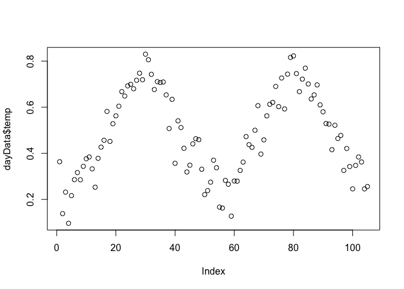
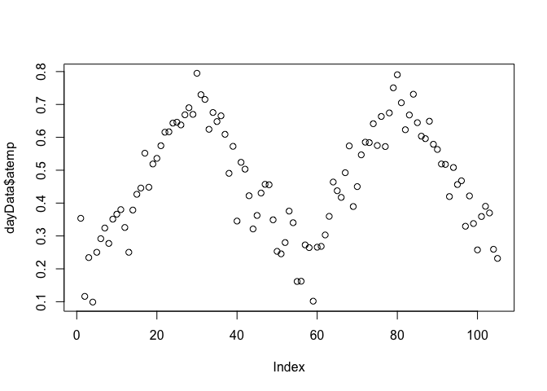
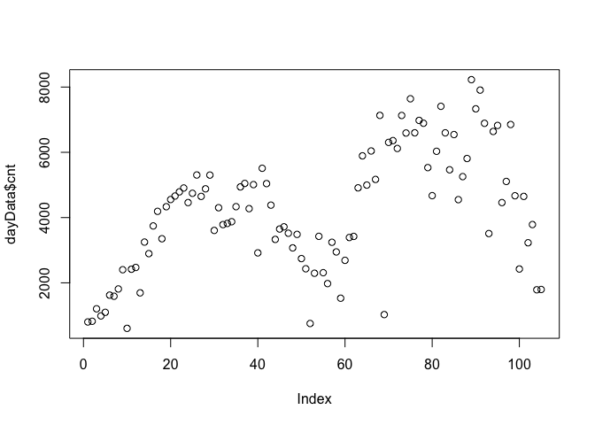
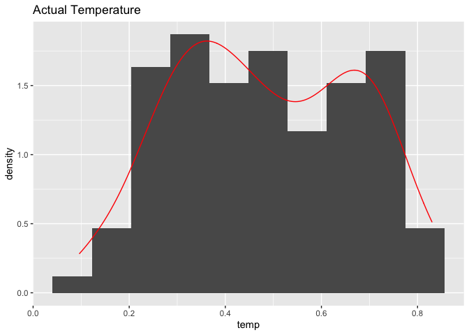
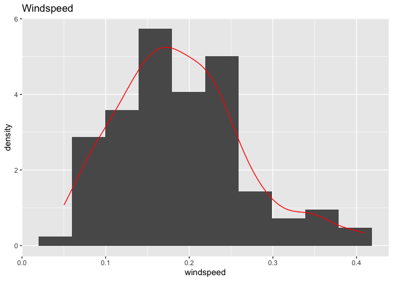
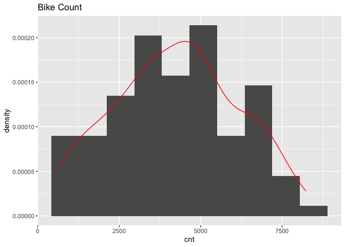

ST558 Project 2: Bike Sharing Analysis
================
Lynn Huang
September 18, 2020

  - [Prepare Data](#prepare-data)
  - [Explore Data](#explore-data)
  - [Regression Tree with LOOCV](#regression-tree-with-loocv)
  - [Boosted Tree with CV](#boosted-tree-with-cv)
  - [Second Analysis](#second-analysis)
      - [Linear model](#linear-model)
          - [Final Model](#final-model)
          - [R Markdown Automation Code](#r-markdown-automation-code)

#### Prepare Data

Source: [UCI Machine Learning
Repository](https://archive.ics.uci.edu/ml/datasets/Bike+Sharing+Dataset)  
We will predict the amount of total rental bikes using predictors like
time of year or time of the week.  
There are n=731 observations and p=16 variables on the Capital bike
sharing system (Washington DC) in 2011-2012:

1.  (ignored\!) instant = Record index (like an observation number)  
2.  (ignored\!) dteday = Date (MM/DD/YYYY format)  
3.  season = Categorical numeric var (1:winter, 2:spring, 3:summer,
    4:fall)  
4.  yr = Year (0:2011, 1:2012)  
5.  mnth = Month (1 to 12)  
6.  holiday = Whether the day is a holiday or not (1/0)  
7.  weekday = Day of the week (0:Sunday to 6:Saturday)  
8.  workingday = Whether the day is a working day or weekend/holiday
    (1/0)  
9.  weathersit = Categorical numeric var for weather situation (1:mild
    to 4:severe)
      - Clear, Few clouds, Partly cloudy  
      - Mist + Cloudy, Mist + Broken clouds, Mist + Few clouds, Mist  
      - Light snow, Light rain + Thunderstorm + Scattered clouds, Light
        rain + Scattered clouds  
      - Heavy rain + Ice pallets + Thunderstorm + Mist, Snow + Fog  
10. temp = Normalized hourly temp in Celsius (Temp - Min.Temp)/(Max.Temp
    - Min.Temp) for Min.Temp=-8 & Max.Temp=39  
11. atemp = Normalized hourly feeling temp in Celsius for Min.Temp=-16 &
    Max.Temp=50  
12. hum = Normalized humidity (Humidity)/(Max.Humidity) for
    Max.Humidity=100  
13. windspeed = Normalized wind speed (Speed)/(Max.Speed) for
    Max.Speed=67  
14. (ignored\!) casual = Count of casual users  
15. (ignored\!) registered = Count of registered users  
16. cnt = Count of total rental bikes (casual + registered)

We will ignore the `casual` and `registered` variables in our analysis.
We will also split the data into analyses by weekday, so 7 separate
analyses for each weekday from Sunday (weekday=0) to Saturday
(weekday=6). This code is specifically run with \`r Per each weekday, we
will:  
\* Do some preliminary numerical and graphical summaries  
\* Split data into 70% training, 30% test data sets  
\* Create a tree-based model using leave one out cross-validation  
\* Create a boosted tree model using cross-validation  
\* Comparison of model performances on the test data set, and selection
of a ‘best model’

``` r
# Drop unused data and make factors as needed for categorical vars
bikeData <- read_csv("day.csv", col_names=TRUE) %>% select(-instant, -dteday, -casual, -registered)
```

    ## Parsed with column specification:
    ## cols(
    ##   instant = col_double(),
    ##   dteday = col_date(format = ""),
    ##   season = col_double(),
    ##   yr = col_double(),
    ##   mnth = col_double(),
    ##   holiday = col_double(),
    ##   weekday = col_double(),
    ##   workingday = col_double(),
    ##   weathersit = col_double(),
    ##   temp = col_double(),
    ##   atemp = col_double(),
    ##   hum = col_double(),
    ##   windspeed = col_double(),
    ##   casual = col_double(),
    ##   registered = col_double(),
    ##   cnt = col_double()
    ## )

``` r
bikeData$season <- as.factor(bikeData$season)
bikeData$yr <- as.factor(bikeData$yr)
bikeData$mnth <- as.factor(bikeData$mnth)
bikeData$holiday <- as.factor(bikeData$holiday)
bikeData$weekday <- as.factor(bikeData$weekday)
bikeData$workingday <- as.factor(bikeData$workingday)
bikeData$weathersit <- as.factor(bikeData$weathersit)

# Slice off data for only this weekday (default Sunday)
dayData <- bikeData %>% filter(weekday == params$day)
head(dayData)
n = nrow(dayData)

# Split into 70% training, 30% test data sets
set.seed(123)
train <- sample(1:n, size = n*0.7)
dayData.train <- dayData[train, ]
dayData.test <- dayData[-train, ]
dayData.train
```

#### Explore Data

We see an even spread across the season, yr, mnth variables (as expected
across a whole year).  
Most of the days were not a holiday. The weekday corresponds to the
report-specific day (as it should\!).

``` r
# Do some basic five-number summaries to check for outliers
summary(dayData)
```

    ##  season yr          mnth    holiday weekday workingday weathersit
    ##  1:27   0:52   1      :10   0:105   0:105   0:105      1:74      
    ##  2:26   1:53   7      :10   1:  0   1:  0   1:  0      2:30      
    ##  3:26          4      : 9           2:  0              3: 1      
    ##  4:26          5      : 9           3:  0                        
    ##                9      : 9           4:  0                        
    ##                10     : 9           5:  0                        
    ##                (Other):49           6:  0                        
    ##       temp             atemp              hum           windspeed      
    ##  Min.   :0.09652   Min.   :0.09884   Min.   :0.2758   Min.   :0.05038  
    ##  1st Qu.:0.33750   1st Qu.:0.34026   1st Qu.:0.5079   1st Qu.:0.13496  
    ##  Median :0.46333   Median :0.45643   Median :0.6317   Median :0.18221  
    ##  Mean   :0.48363   Mean   :0.46529   Mean   :0.6277   Mean   :0.18853  
    ##  3rd Qu.:0.65333   3rd Qu.:0.60923   3rd Qu.:0.7400   3rd Qu.:0.22761  
    ##  Max.   :0.83000   Max.   :0.79483   Max.   :0.9483   Max.   :0.40921  
    ##                                                                        
    ##       cnt      
    ##  Min.   : 605  
    ##  1st Qu.:2918  
    ##  Median :4334  
    ##  Mean   :4229  
    ##  3rd Qu.:5464  
    ##  Max.   :8227  
    ## 

``` r
bikeData[is.na(bikeData)==TRUE]
```

    ## <unspecified> [0]

``` r
# Take a look at the numeric, non-factor variables
# Looks like temp, atemp, cnt are clearly bimodal with 2 peaks around indices 20 (May) and 80 (July) when the weather is nice for bike riding!
plot(dayData$temp)
```

<!-- -->

``` r
plot(dayData$atemp)
```

<!-- -->

``` r
plot(dayData$hum)
```

<!-- -->

``` r
plot(dayData$windspeed)
```

<!-- -->

``` r
plot(dayData$cnt)
```

<!-- -->

``` r
# Do some histograms to check the distributions of numeric, non-factor variables
# Temperature, humidity variables are bimodal as expected
ggplot(data=dayData, aes(x=temp)) + geom_histogram(bins=10, aes(y=..density..)) + 
  geom_density(color="red") + labs(title="Actual Temperature")
```

<!-- -->

``` r
ggplot(data=dayData, aes(x=atemp)) + geom_histogram(bins=10, aes(y=..density..)) + 
  geom_density(color="red") + labs(title="Actual Temperature")
```

<!-- -->

``` r
ggplot(data=dayData, aes(x=hum)) + geom_histogram(bins=10, aes(y=..density..)) + 
  geom_density(color="red") + labs(title="Humidity")
```

<!-- -->

``` r
# Windspeed is a bit skewed right, but we're not doing linear regression. This is ok!
ggplot(data=dayData, aes(x=windspeed)) + geom_histogram(bins=10, aes(y=..density..)) + 
  geom_density(color="red") + labs(title="Windspeed")
```

<!-- -->

``` r
# Bike Count shows a huge spread
ggplot(data=dayData, aes(x=cnt)) + geom_histogram(bins=10, aes(y=..density..)) + 
  geom_density(color="red") + labs(title="Bike Count")
```

<!-- -->

#### Regression Tree with LOOCV

We will use the caret package to automate LOOCV for “rpart” method for a
regression tree.  
Because of LOOCV, this will take awhile on bigger n (we’re okay)\! Good
idea to cache results.

``` r
tree.cv <- train(cnt ~ .,
                 data = dayData.train,
                 method = "rpart",
                 trControl = trainControl(method="LOOCV"),
                 tuneGrid = expand.grid(cp=seq(0, 0.15, 0.01)))
tree.cv
```

    ## CART 
    ## 
    ## 73 samples
    ## 11 predictors
    ## 
    ## No pre-processing
    ## Resampling: Leave-One-Out Cross-Validation 
    ## Summary of sample sizes: 72, 72, 72, 72, 72, 72, ... 
    ## Resampling results across tuning parameters:
    ## 
    ##   cp    RMSE       Rsquared   MAE     
    ##   0.00   924.5444  0.7403306  730.0692
    ##   0.01   933.2153  0.7356145  736.5043
    ##   0.02  1034.8538  0.6775319  839.5168
    ##   0.03   988.0095  0.7019258  774.6672
    ##   0.04   945.9863  0.7266816  751.5176
    ##   0.05   945.9863  0.7266816  751.5176
    ##   0.06   945.9863  0.7266816  751.5176
    ##   0.07   945.9863  0.7266816  751.5176
    ##   0.08   945.9863  0.7266816  751.5176
    ##   0.09   945.9863  0.7266816  751.5176
    ##   0.10   945.9863  0.7266816  751.5176
    ##   0.11   945.9863  0.7266816  751.5176
    ##   0.12   945.9863  0.7266816  751.5176
    ##   0.13   945.9863  0.7266816  751.5176
    ##   0.14   945.9863  0.7266816  751.5176
    ##   0.15   945.9863  0.7266816  751.5176
    ## 
    ## RMSE was used to select the optimal model using the smallest value.
    ## The final value used for the model was cp = 0.

``` r
best.cp <- tree.cv$bestTune$cp
best.rmse <- tree.cv$results$RMSE[tree.cv$results$cp==best.cp]
best.RSquared <- tree.cv$results$Rsquared[tree.cv$results$cp==best.cp]
best.MAE <- tree.cv$results$MAE[tree.cv$results$cp==best.cp]
```

The best complexity parameter was 0, based on lowest RMSE (unexplained
variation) of 924.5444398.

``` r
tree.cv$finalModel
```

    ## n= 73 
    ## 
    ## node), split, n, deviance, yval
    ##       * denotes terminal node
    ## 
    ##  1) root 73 238867000 4412.904  
    ##    2) temp< 0.40875 23  23166240 2429.435  
    ##      4) temp< 0.3211775 14   5403565 2015.929 *
    ##      5) temp>=0.3211775 9  11645120 3072.667 *
    ##    3) temp>=0.40875 50  83591950 5325.300  
    ##      6) yr1< 0.5 24  12469400 4319.542  
    ##       12) temp< 0.5095835 7   1930055 3605.143 *
    ##       13) temp>=0.5095835 17   5495730 4613.706 *
    ##      7) yr1>=0.5 26  24435640 6253.692  
    ##       14) weathersit2>=0.5 8   6980305 5609.875 *
    ##       15) weathersit2< 0.5 18  12665550 6539.833 *

``` r
plot(tree.cv$finalModel, margin=0.2); text(tree.cv$finalModel, cex=0.8)
```

<!-- -->

#### Boosted Tree with CV

We can often improve prediction using boosting, which is slow training
of trees that are grown sequentially. We make many weak, shallow trees
that each grow on a modified version of the original data, with the goal
to improve on error rate.  
Because LOOCV can be time-consuming, let’s just use 10-fold cross
validation. This could still take quite some time if you have a lot of
tuning parameters\!

``` r
# Turn warnings off because R will complain about factor levels having 0 variance
# Running this w/o tuneGrid gives n.trees=150, interaction.depth=2, shrinkage=0.1, n.minobsinnode=10
# So, try tuning in those neighborhoods of values
boost.cv <- train(cnt ~ .,
                  data = dayData.train,
                  method = "gbm",
                  distribution = "gaussian",
                  trControl = trainControl(method="cv", number=10),
                  tuneGrid = expand.grid(n.trees=c(1000, 5000, 10000),
                                         interaction.depth=1:4,
                                         shrinkage=c(0.01, 0.1),
                                         n.minobsinnode=c(1,5,10)),
                  verbose = FALSE)
boost.cv$bestTune
```

# Second Analysis

## Linear model

``` r
lm.fit <- lm(cnt~temp+windspeed+atemp+hum, data =dayData.train)
summary(lm.fit)
```

    ## 
    ## Call:
    ## lm(formula = cnt ~ temp + windspeed + atemp + hum, data = dayData.train)
    ## 
    ## Residuals:
    ##     Min      1Q  Median      3Q     Max 
    ## -3317.0  -913.0  -267.8   800.6  3124.4 
    ## 
    ## Coefficients:
    ##             Estimate Std. Error t value Pr(>|t|)  
    ## (Intercept)     2319       1104   2.101   0.0394 *
    ## temp           -2736      11656  -0.235   0.8152  
    ## windspeed      -2934       2407  -1.219   0.2271  
    ## atemp          10494      13208   0.795   0.4296  
    ## hum            -1762       1234  -1.428   0.1578  
    ## ---
    ## Signif. codes:  0 '***' 0.001 '**' 0.01 '*' 0.05 '.' 0.1 ' ' 1
    ## 
    ## Residual standard error: 1391 on 68 degrees of freedom
    ## Multiple R-squared:  0.4495, Adjusted R-squared:  0.4171 
    ## F-statistic: 13.88 on 4 and 68 DF,  p-value: 2.497e-08

``` r
final.fit <- train(as.formula(cnt~temp+windspeed+atemp+hum),
              dayData.test,method='lm',
              trControl = trainControl(method = 'cv',number=5))
final.fit$results$RMSE
```

    ## [1] 1263.264

#### Final Model

We compare the final models selected from `tree.cv` ,`boost.cv` and
`linear model`for best performance on the test dataset. We measure
performance as the smallest RMSE (root mean squared error), which
reflects unexplained variation. Then, we’ll take the best model and
report it’s parameters.

``` r
regPred <- predict(tree.cv, newdata=dayData.test)
reg.rmse <- sqrt(mean((regPred - dayData.test$cnt)^2))

boostPred <- predict(boost.cv, newdata=dayData.test)
boost.rmse <- sqrt(mean((boostPred - dayData.test$cnt)^2))

RMSE.vals <- data.frame(c(reg.rmse, boost.rmse,final.fit$results$RMSE))
rownames(RMSE.vals) <- c("Regression Tree", "Boosted Tree","linear model")
colnames(RMSE.vals) <- "RMSE"
kable(RMSE.vals)
```

|                 |      RMSE |
| :-------------- | --------: |
| Regression Tree | 1062.5298 |
| Boosted Tree    |  606.2937 |
| linear model    | 1263.2644 |

We prefer the model with lower RMSE.We found that linear model is the
optimal model.

#### R Markdown Automation Code

Please don’t run this when knitting Project2.Rmd\! You’ll want to run
this separately (like in the Console) to get all the reports. Just
putting this here so it doesn’t get lost\! You can access these R
Markdwon parameters using `params$weekday` in the R Code during each
automated run.

``` r
days <- c("Sunday", "Monday", "Tuesday", "Wednesday", "Thursday", "Friday", "Saturday", "Sunday")
outFiles <- paste0(days, "Analysis.md")
for (i in 1:7){
  rmarkdown::render("Project2.Rmd", output_file=outFiles[i], params=list(day=(i-1)))
}
```
